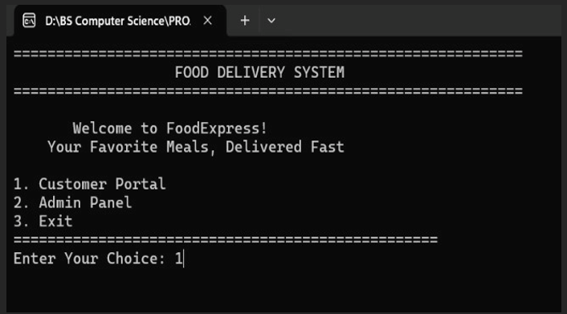
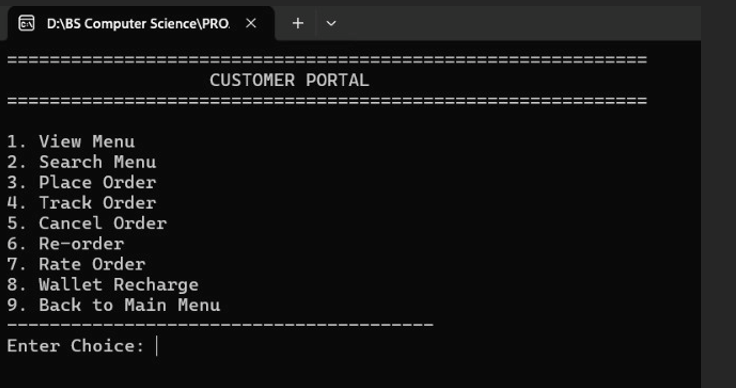
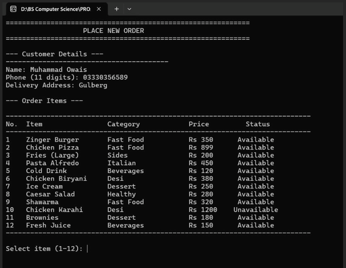
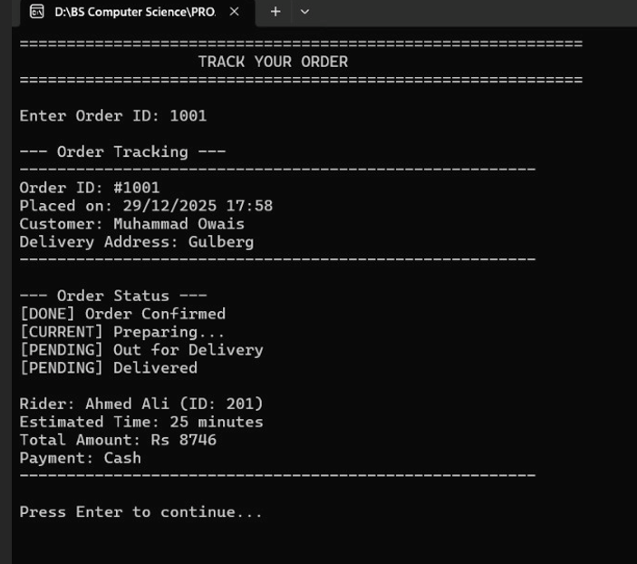
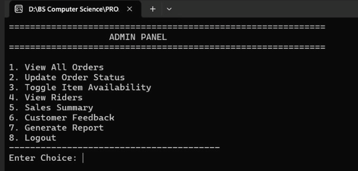
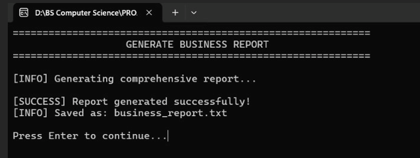

# FoodExpress - C++ Food Ordering & Delivery System

FoodExpress is a robust, terminal-based Management Information System (MIS) built entirely in C++. It digitizes restaurant operations by handling everything from customer orders and digital wallet payments to delivery logistics and administrative business analytics. 

Designed with a modular, multi-tier architecture, this project demonstrates clean separation of concerns, file-handling persistence, and memory-safe C++ practices.

## Screenshots

### Main Menu

*The primary entry point for the FoodExpress system.*

### Customer Portal

*Clean, interactive command-line UI for customer navigation and wallet management.*

### Place New Order

*Dynamic receipt generation calculating GST, delivery fees, and applying promo codes.*

### Track Your Order

*Real-time status updates showing the progression from pending to delivered.*

### Admin Panel

*Secure backend for managing orders, toggling menu availability, and tracking riders.*

### Generate Business Report

*Automated export of comprehensive sales summaries and customer satisfaction metrics.*

---

## Key Features

### Customer Portal
* **Interactive Menu & Search:** Browse food categories or search by keyword with real-time availability tracking.
* **Smart Order Processing:** Generates unique order IDs, calculates dynamic delivery fees based on location, applies GST (5%), and validates promo codes.
* **Digital Wallet Integration:** Users can recharge their balance and seamlessly pay for orders without cash.
* **Live Order Tracking:** Track the exact status of an order (`Pending` ➔ `Preparing` ➔ `Out for Delivery` ➔ `Delivered`) and see the assigned rider.
* **Review System:** Rate orders and earn loyalty points for high ratings.

### Admin & Staff Panel
* **Order Management:** View all incoming orders and update their fulfillment status in real-time.
* **Menu Control:** Instantly toggle the availability of specific food items (e.g., mark "Chicken Karahi" out of stock).
* **Delivery Logistics:** Automatically assigns the first available rider to new orders and tracks their delivery counts.
* **Business Analytics:** Generates comprehensive sales summaries breaking down total revenue, discounts given, tax collected, and payment methods used.
* **Automated Reporting:** Exports business performance and customer satisfaction metrics to a clean `.txt` file for record-keeping.

---

## Project Architecture

The codebase is refactored into a highly modular structure to ensure scalability and maintainability:

* `main.cpp` - Application entry point and main menu loop.
* `Globals.h/cpp` - Centralized state management containing structural definitions and the global item array.
* `App.h/cpp` - Core application logic handling the Customer and Admin user interfaces.
* `Services.h/cpp` - Backend background services (Wallet transactions, Promo validation, Rider assignment).
* `Utils.h/cpp` - Reusable utility functions (Time fetching, UI formatting, input validation).

**Data Persistence:** The system uses flat-file storage to maintain state between sessions. It automatically manages `orders.txt`, `wallet.txt`, `riders.txt`, `promocodes.txt`, and `feedback.txt`.

---

## How to Run Locally

### Prerequisites
You will need a C++ compiler (like GCC/G++) installed on your machine.

### Compilation
Open your terminal in the project directory and compile all the modules together:

```bash
g++ main.cpp Globals.cpp Utils.cpp Services.cpp App.cpp -o FoodExpress
